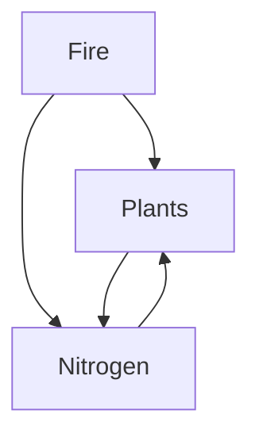

# Header

## Header

### Header

### Header

#### Header

###### Header

## un-ordered list 

* Red
* Green
* Blue

## ordered list

1. Red
2. Green 
3. Blue

Paragraph line break  

Here is a link to [Google][http://google.com] 

Here's an image: 


> Here is a block quote
>
> > here is another block quote 


Plain code blocks

R code block: 

```R
function test()  ### R code 
```

In line r code ```{r} function test() ```

Centered LaTex eqaution 
$$
\mathbf{V}_1 \times \mathbf{V}_2 =  \begin{vmatrix}
\mathbf{i} & \mathbf{j} & \mathbf{k} \\
\frac{\partial X}{\partial u} &  \frac{\partial Y}{\partial u} & 0 \\
\frac{\partial X}{\partial v} &  \frac{\partial Y}{\partial v} & 0 \\
\end{vmatrix}
$$


In line LaTex equation 

$H~2~0$


Horizontal line below 

***

Simple table 

| Clothes | Cost |
| :-----: | :--: |
|  Shoes  | $50  |
|  Shirt  | $15  |
|  Pants  | $30  |
| Jacket  | $89  |


Hand drawn diagram: 


Flow diagram 




